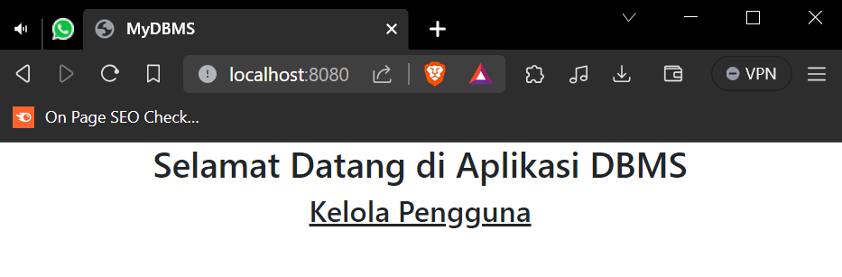

## An RESTful API for database management system

This app build using spring boot. 

To run this application on your computer, at least you need:

- JDK 17
- mysql
- IntelliJ IDEA(optional)

## Getting Started

You need to run the main class [here]([here](src/main/java/DBMS/MydbmsApplication.java))

Open new tab on Your browser type `http://localhost:8080` You will probably see results like in the photo below

I also put JDBC driver [here](assets/mysql-connector-j-8.0.32.jar) if necessary.